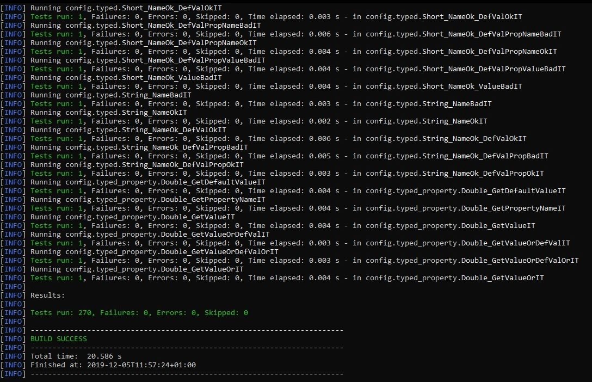

# Configurator Tests
- This application exposes JAX-RS endpoints that use Configurator to inject tested values.  
  Then the JUnit tests use a JAX-RS client to access these endpoints to test the injected values.
- There are 270 tests.
- Tests the most important cases:
  - All configurator annotations - @Config, @ConfigTyped, @ConfigJson.
  - TypedProperty class.
  - Values from different sources (environmental variables, system properties, property files, json files, urls, class members).
  - Default values from different sources.
  - Runtime checks for values and default values.  
   First checks a value from an endpoint.
   Then changes the source value and checks the endpoint again.
   Depending on the runtime check setting checks then whether the value changed or not.
  - And more.


### Running the tests
- Install the [Configurator](https://github.com/ArekLopus/Configurator), it is needed as a dependency.
- Copy the 'config' folder to the root of the drive where your application server is located.
  - This folder contains property and json files needed for testing.
- Deploy the test application 'ConfiguratorTest.war' from the '/target/' foder on your application server.
  - Or compile it yourself using the `mvn package` command.
  - Server must run on '8080' port! The JAX-RS client tests use this port number (It is the defualt port for most of the application servers).
- Run `mvn failsafe:integration-test` where the 'pom.xml' is placed to start the tests.


### Generic bound warnings

- These warnings occur for tests where no generic parameter is set on the TypedProperty class.
- It happens during a JSON serialization and it is just a warning.

```
Nov 28, 2019 3:25:48 PM org.eclipse.yasson.internal.ReflectionUtils resolveItemVariableType
WARNING: Generic bound not found for type T declared in class configurator.TypedProperty.
Nov 28, 2019 3:25:48 PM org.eclipse.yasson.internal.ReflectionUtils resolveItemVariableType
WARNING: Generic bound not found for type T declared in class configurator.TypedProperty.
Nov 28, 2019 3:25:48 PM org.eclipse.yasson.internal.ReflectionUtils resolveItemVariableType
WARNING: Generic bound not found for type T declared in class configurator.TypedProperty.
Nov 28, 2019 3:25:48 PM org.eclipse.yasson.internal.ReflectionUtils resolveItemVariableType
WARNING: Generic bound not found for type T declared in class configurator.TypedProperty.
```

### Tested on Servers:
- Apache TomEE /9.0.22 (8.0.0)
- Wildfly 18.0.1.Final
- Payara 5.194
- Open Liberty 19.0.0.12





---


